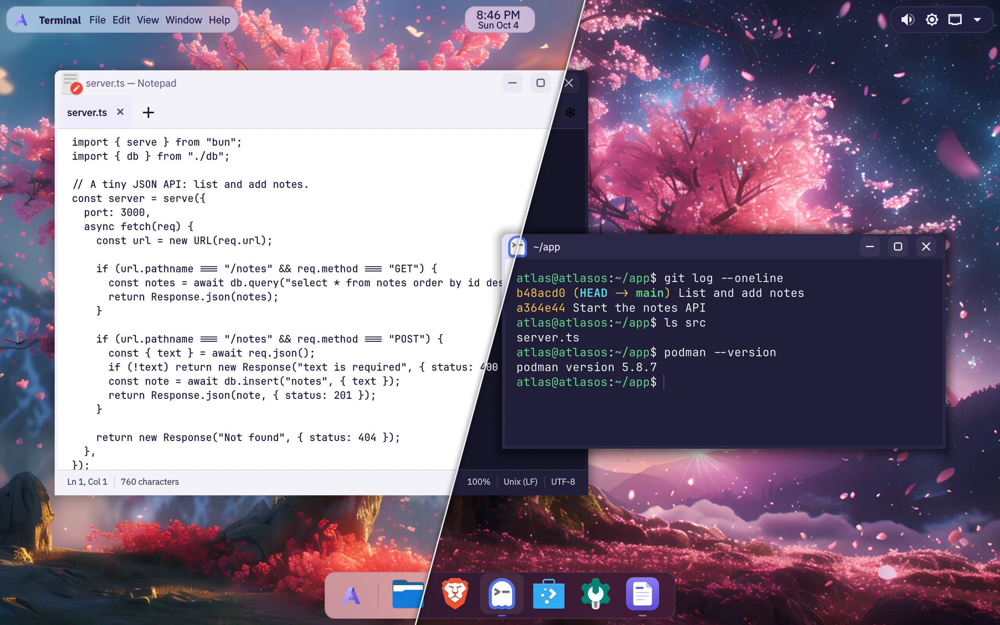
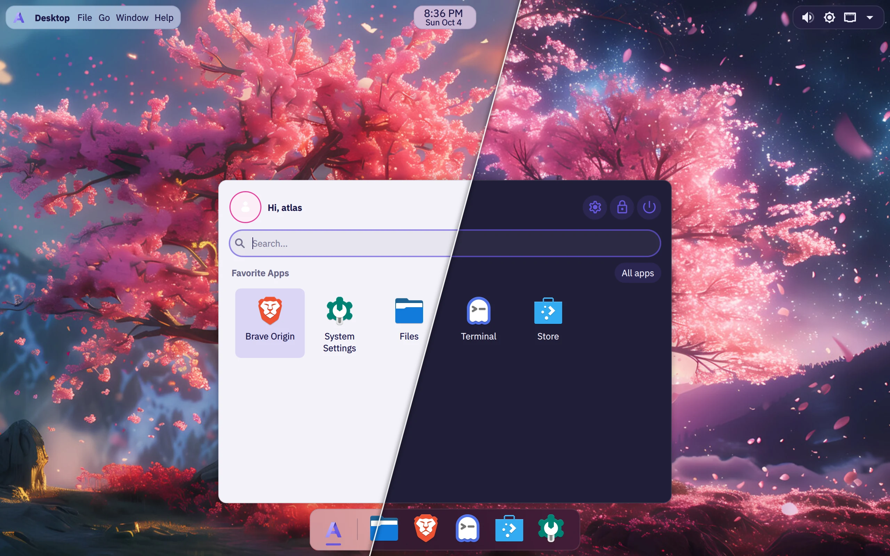
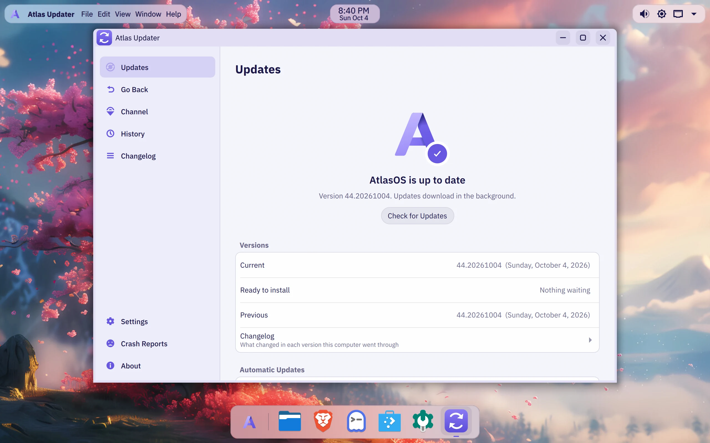
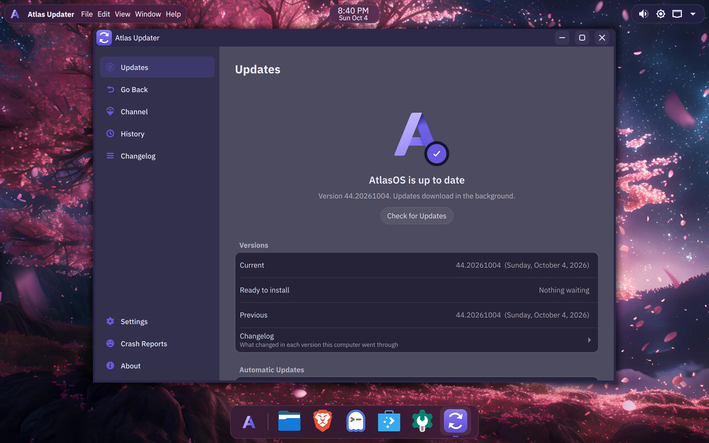
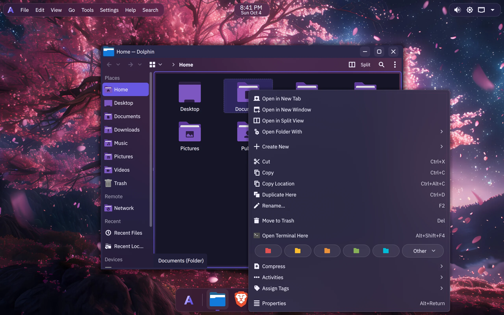
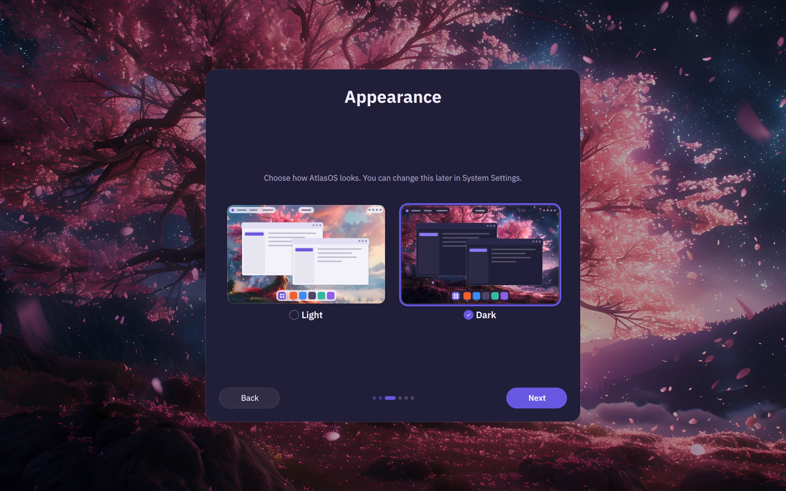
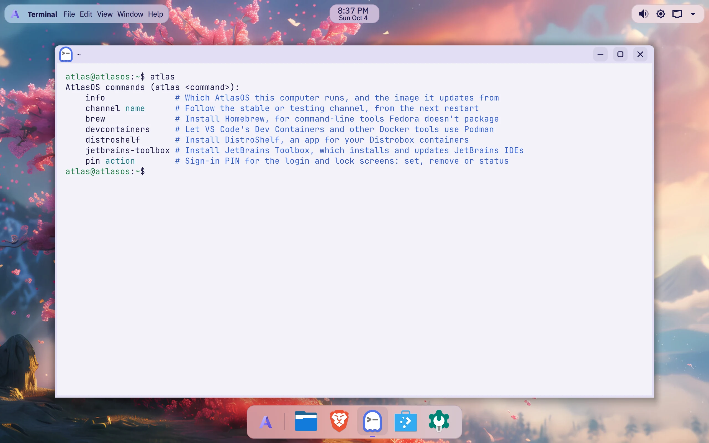

# AtlasOS Linux

**My own take on a KDE desktop: clean, fast, a bit of macOS and Windows 11,
and updates that never get in your way.**

AtlasOS Linux is its own project. It isn't related to AtlasOS, the Windows
modification by Atlas-OS.



AtlasOS is a personal Linux distro I've been building on top of
[Fedora Kinoite 44](https://fedoraproject.org/atomic-desktops/kinoite/). It
keeps everything good about Fedora and KDE Plasma and drops what most people
never use. The result idles at about **1 GB of RAM, around half of stock
Kinoite**, and it looks the way I always wanted a Linux desktop to look out of
the box.

Under the hood it's an *image-based* system
([bootc](https://bootc-dev.github.io/bootc/)): the whole OS is one tested
image, updated in one piece. If an update ever breaks something, you can go
back to the previous version, and if it won't even boot properly, AtlasOS
rolls itself back.

## Highlights

**It looks good out of the box**
- A macOS-style menu bar on top, as three floating islands (app menus on
  the left, the time and date in the middle, the tray on the right), and a
  floating dock at the bottom with your apps, a short underline under the
  ones that are open. Both are see-through and blurred, and both get out of
  the way: a maximized app gets the whole screen, and **Meta+M** brings the
  menu bar back over it.
- An app launcher centred over the dock, your favourite apps up front. Its
  search is the one search: there's no separate KRunner bar.
- Notifications slide down at the top centre, under the clock.
- Two themes made from the logo's violets: AtlasOS Light and AtlasOS Dark.
  That's it, no wall of half-finished themes. Each has its own Bibata
  cursor (white with Light, black with Dark), Papirus icons (violet folders,
  a dark variant with Dark), and the sakura wallpaper turns to night with
  Dark.
- A first-run setup in the same style: language, keyboard, Light or Dark,
  the computer's name, the time zone and your account, one page at a time.
- Rounded windows, soft shadows and acrylic-style menus, and right-click
  menus that keep every action. It's Plasma and KWin with AtlasOS's own style
  for the desktop and the apps, so nothing extra runs in the background.
- A macOS-style login and lock screen, a custom boot splash, IBM Plex Sans
  for the interface and JetBrains Mono for code.
- The everyday apps and codecs are included: Gwenview, Okular, Haruna and
  Qalculate! in the AtlasOS look, and video plays (with GPU decoding) out of
  the box.

**Updates that stay out of your way**
- **Atlas Updater**, my own update app (Rust + Qt), sits in the tray. Updates
  download in the background and wait for *you*: restart now, or pick a time.
- See what's new in each version before you restart, and update your Flatpak
  apps from the same window.
- **Go Back** to the previous version in one click if you don't like an
  update.
- **Automatic rollback**: if a new version fails its startup checks, AtlasOS
  goes back to the last good one on its own, and won't download that version
  again.
- Two channels: **Stable** (weekly) and **Testing** (daily, for the brave).

**Made for developers**
- [Ghostty](https://ghostty.org) as the terminal (Ctrl+Alt+T), with
  "Open Terminal Here" in Dolphin.
- Podman with a `docker` command and compose, Toolbox and Distrobox for
  mutable dev environments, and [mise](https://mise.jdx.dev) for Node,
  Python, Go and friends.
- git, gh, just, jq, ripgrep, fd, gdb, strace and perf, already there
  (Atlas Monitor in place of btop).
- Atlas Notepad as the text editor, and file watch limits raised for big projects.
- `atlas`, a command menu for the rest: Homebrew, Docker tools on Podman,
  JetBrains Toolbox, the update channel. Where each kind of software goes:
  [Installing software](docs/INSTALLING-SOFTWARE.md).

**Less stuff, on purpose**
- No Akonadi, no Baloo indexer, no KDE Connect, no pile of apps you'll never
  open. Brave Origin replaces Firefox, and Flathub is set up for everything
  else.
- No telemetry. Crash reports are **off** by default, and if you turn them on
  you see every report in full and decide each time. See
  [PRIVACY.md](docs/PRIVACY.md).

## Screenshots

| The app launcher, Light and Dark |
|---|
|  |

| Atlas Updater, light | Atlas Updater, dark |
|---|---|
|  |  |

| A right-click menu that keeps every action |
|---|
|  |

| First-run setup: Light or Dark |
|---|
|  |



## By the numbers

Measured in an 8 GB virtual machine, two minutes after login:

| | Stock Kinoite 44 | AtlasOS |
|---|---|---|
| Memory in use at idle | 2,075 MiB | **~990 MiB** |
| Running processes, all together (`ps_mem`) | | ~750 MiB |

The desktop is ready about 8 seconds after the kernel starts, in the same VM.
How it got there, change by change: [OPTIMIZATION.md](docs/OPTIMIZATION.md).

## System requirements

| | Minimum | Recommended |
|---|---|---|
| Processor | 64-bit Intel or AMD (x86_64), 2 cores | 4 cores or more |
| Memory | 4 GB | 8 GB or more |
| Storage | 40 GB | 64 GB or more, on an SSD |
| Graphics | Anything with an open-source driver: Intel, AMD, or NVIDIA with nouveau | Intel or AMD; NVIDIA GeForce GTX 16 / RTX 20 series or newer with the `atlasos-nvidia` image |
| Firmware | UEFI | UEFI |
| Internet | Needed to install and for updates | |

Why these numbers:

- **Memory:** the desktop uses just under 1 GB at idle, and downloading an update
  briefly takes up to about 2 GB more. AtlasOS is tuned for and tested on
  8 GB. 4 GB works for lighter use, with zram swap helping out.
- **Storage:** an installed system keeps the current and the previous
  version, about 9 GB together (a little more with the NVIDIA image). A new update needs room next to them while it
  downloads, and then come your apps and files.
- **Graphics:** NVIDIA's own driver comes in a separate image,
  `ghcr.io/eternalcoder454/atlasos-nvidia`, the same system plus the driver.
  It uses NVIDIA's open kernel modules, so it needs a GeForce GTX 16 or
  RTX 20 series card or newer; older NVIDIA cards run on the main image with
  nouveau. With Secure Boot on, a dialog at login walks you through trusting the AtlasOS key once (see
  [DEV.md](DEV.md#nvidia)).
- **Firmware:** everything is tested on UEFI. Older BIOS-only machines
  aren't tested.

## Installing

Download the ISO from [atlasos.eterneon.net](https://atlasos.eterneon.net/#download),
write it to a USB stick of 8 GB or more (Fedora Media Writer does it), and
boot from it: the installer starts by itself. There's an NVIDIA ISO for
GeForce GTX 16 / RTX 20 series cards and newer.

Already on [Fedora Kinoite 44](https://fedoraproject.org/atomic-desktops/kinoite/)
or another Fedora Atomic desktop? Switch it over instead:

```bash
sudo bootc switch ghcr.io/eternalcoder454/atlasos:stable
```

With a GeForce GTX 16 / RTX 20 series card or newer, use
`ghcr.io/eternalcoder454/atlasos-nvidia:stable` instead. Restart, and
you're on AtlasOS. Your files in `/home` stay as they are.

A few honest notes:

- The ISOs are built from each weekly stable release. You can build one
  yourself with `just iso`, which needs the
  [AtlasOS Installer](https://github.com/EternalCoder454/atlasos-installer)
  source beside this repository (see [DEV.md](DEV.md)).
- The images are signed, and AtlasOS only installs updates that carry the
  signature. A computer that installed AtlasOS before that starts checking
  by itself with its first signed version.
- This is a personal project run by one person. It works well for me every
  day, but it's young, so keep backups like you would anyway.

## How it was made

AtlasOS was built with [Claude Code](https://claude.com/claude-code), but
it isn't a "make me a distro" prompt. I planned every step myself: what goes
in, what comes out, how it should look and feel, and in what order. That plan
lives in a roadmap. Claude Code wrote the code and the build scripts, and
every item was built and tested in a virtual machine before it was ticked off.
That includes broken updates on purpose, to watch the automatic rollback do
its job.

The decisions are mine: Ghostty over Konsole, Brave Origin over Firefox,
keeping every animation people can actually see, and the menu bar plus
dock combo. The test reports are in [docs/](docs/) if you want the
details.

## What's next

- More Atlas apps in the same style as Atlas Updater: a welcome app, an app
  store, settings, a launcher, notes and a file manager.

## For developers

How the image is built, how updates and rollbacks work under the hood, the
CI, and how to test it all in a VM: **[DEV.md](DEV.md)**.

## Thanks

AtlasOS stands on the work of [Fedora](https://fedoraproject.org),
[KDE](https://kde.org), [Universal Blue](https://universal-blue.org)'s image
template, [bootc](https://bootc-dev.github.io/bootc/),
[greenboot](https://github.com/fedora-iot/greenboot-rs),
[Ghostty](https://ghostty.org), [Brave](https://brave.com),
[IBM Plex](https://www.ibm.com/plex/),
[JetBrains Mono](https://www.jetbrains.com/lp/mono/),
[Bibata](https://github.com/ful1e5/Bibata_Cursor),
[Papirus](https://github.com/PapirusDevelopmentTeam/papirus-icon-theme),
[Kvantum](https://github.com/tsujan/Kvantum),
and [Andromeda Launcher](https://github.com/EliverLara/AndromedaLauncher).

## License

Apache-2.0
