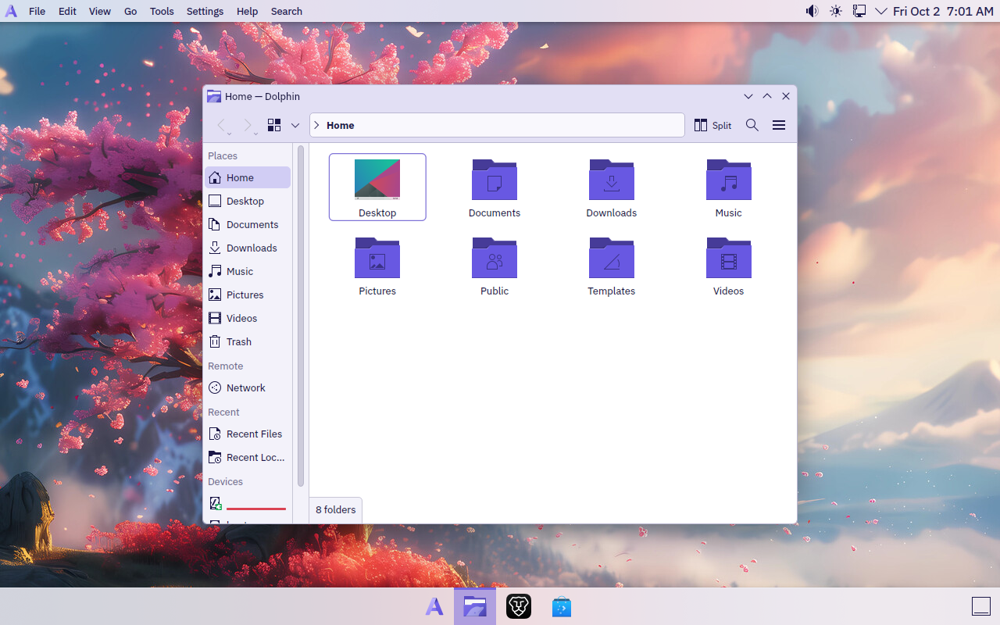
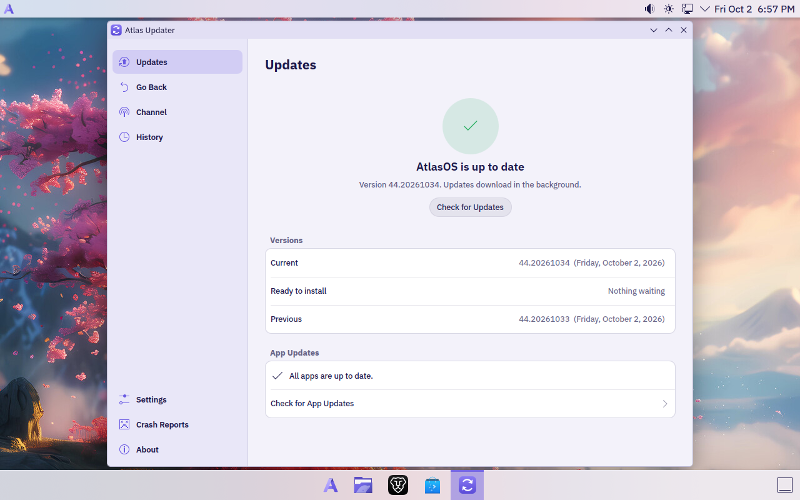
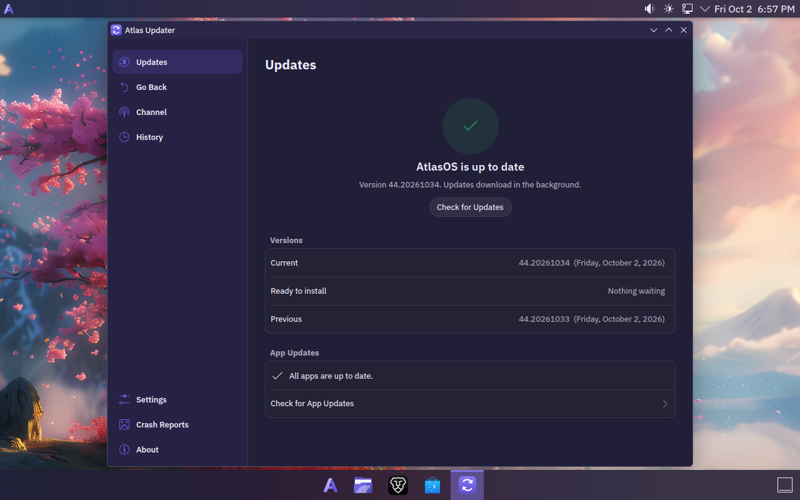
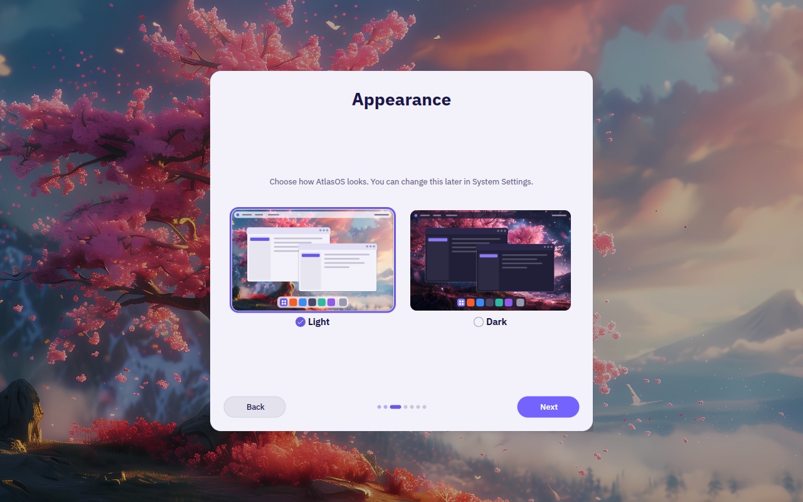
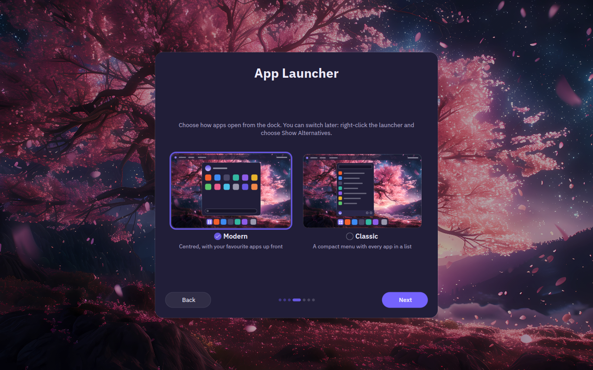
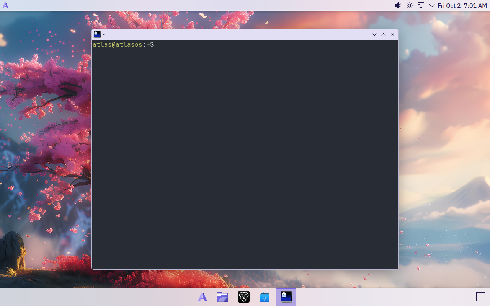

# AtlasOS

**My own take on a KDE desktop: clean, fast, a bit of macOS and Windows 11,
and updates that never get in your way.**



AtlasOS is a personal Linux distro I've been building on top of
[Fedora Kinoite 44](https://fedoraproject.org/atomic-desktops/kinoite/). It
keeps everything good about Fedora and KDE Plasma and drops what most people
never use. The result idles at about **1 GB of RAM, around half of stock
Kinoite**, and it looks the way I always wanted a Linux desktop to look out of
the box.

Under the hood it's an *image-based* system
([bootc](https://bootc-dev.github.io/bootc/)): the whole OS is one tested
image, updated in one piece. If an update ever breaks something, you can go
back to the previous version, and if it won't even boot properly, AtlasOS
rolls itself back.

## Highlights

**It looks good out of the box**
- A macOS-style menu bar on top (app menus, tray, clock) and a floating dock
  at the bottom with your apps, a short underline under the ones that are
  open. Both are see-through and blurred.
- Two app launchers, picked when you set up your computer: **Modern**
  (centred over the dock, your favourite apps up front) or **Classic** (a
  compact menu with every app in a list). To switch later, right-click the
  launcher and choose Show Alternatives.
- Two themes made from the logo's violets: AtlasOS Light and AtlasOS Dark.
  That's it, no wall of half-finished themes. Each has its own Bibata
  cursor (white with Light, black with Dark), both use the Dracula icons,
  and the sakura wallpaper turns to night with Dark.
- A first-run setup in the same style: language, keyboard, Light or Dark,
  your launcher and your account, one page at a time.
- Rounded windows, soft shadows and acrylic-style menus. It's all Plasma's
  own Breeze and KWin, set up properly, so nothing extra runs in the background.
- A macOS-style login and lock screen, a custom boot splash, IBM Plex Sans
  for the interface and JetBrains Mono for code.

**Updates that stay out of your way**
- **Atlas Updater**, my own update app (Rust + Qt), sits in the tray. Updates
  download in the background and wait for *you*: restart now, or pick a time.
- See what's new in each version before you restart, and update your Flatpak
  apps from the same window.
- **Go Back** to the previous version in one click if you don't like an
  update.
- **Automatic rollback**: if a new version fails its startup checks, AtlasOS
  goes back to the last good one on its own, and won't download that version
  again.
- Two channels: **Stable** (weekly) and **Testing** (daily, for the brave).

**Made for developers**
- [Ghostty](https://ghostty.org) as the terminal (Ctrl+Alt+T), with
  "Open Ghostty Here" in Dolphin.
- Podman with a `docker` command and compose, Toolbox and Distrobox for
  mutable dev environments, and [mise](https://mise.jdx.dev) for Node,
  Python, Go and friends.
- git, gh, just, jq, ripgrep, fd, btop, gdb, strace and perf, already there.
- Kate as the default editor, and file watch limits raised for big projects.
- `atlas`, a command menu for the rest: Homebrew, Docker tools on Podman,
  JetBrains Toolbox, the update channel. Where each kind of software goes:
  [Installing software](docs/INSTALLING-SOFTWARE.md).

**Less stuff, on purpose**
- No Akonadi, no Baloo indexer, no KDE Connect, no pile of apps you'll never
  open. Brave Origin replaces Firefox, and Flathub is set up for everything
  else.
- No telemetry. Crash reports are **off** by default, and if you turn them on
  you see every report in full and decide each time. See
  [PRIVACY.md](docs/PRIVACY.md).

## Screenshots

| Atlas Updater, light | Atlas Updater, dark |
|---|---|
|  |  |

| First-run setup: Light or Dark | First-run setup: the app launcher |
|---|---|
|  |  |



## By the numbers

Measured in an 8 GB virtual machine, two minutes after login:

| | Stock Kinoite 44 | AtlasOS |
|---|---|---|
| Memory in use at idle | 2,075 MiB | **~990 MiB** |
| Running processes, all together (`ps_mem`) | | ~750 MiB |

The desktop is ready about 8 seconds after the kernel starts, in the same VM.
How it got there, change by change: [OPTIMIZATION.md](docs/OPTIMIZATION.md).

## System requirements

| | Minimum | Recommended |
|---|---|---|
| Processor | 64-bit Intel or AMD (x86_64), 2 cores | 4 cores or more |
| Memory | 4 GB | 8 GB or more |
| Storage | 30 GB | 64 GB or more, on an SSD |
| Graphics | Anything with an open-source driver: Intel, AMD, or NVIDIA with nouveau | Intel or AMD; NVIDIA GeForce GTX 16 / RTX 20 series or newer with the `atlasos-nvidia` image |
| Firmware | UEFI | UEFI |
| Internet | Needed to install and for updates | |

Why these numbers:

- **Memory:** the desktop uses just under 1 GB at idle, and downloading an update
  briefly takes up to about 2 GB more. AtlasOS is tuned for and tested on
  8 GB. 4 GB works for lighter use, with zram swap helping out.
- **Storage:** an installed system keeps the current and the previous
  version, about 9 GB together (a little more with the NVIDIA image). A new update needs room next to them while it
  downloads, and then come your apps and files.
- **Graphics:** NVIDIA's own driver comes in a separate image,
  `ghcr.io/eternalcoder454/atlasos-nvidia`, the same system plus the driver.
  It uses NVIDIA's open kernel modules, so it needs a GeForce GTX 16 or
  RTX 20 series card or newer; older NVIDIA cards run on the main image with
  nouveau. With Secure Boot on, you enroll the AtlasOS key once (see
  [DEV.md](DEV.md#nvidia)).
- **Firmware:** everything is tested on UEFI. Older BIOS-only machines
  aren't tested.

## Installing

AtlasOS is installed by switching an existing Fedora Atomic system over to
it. Install [Fedora Kinoite 44](https://fedoraproject.org/atomic-desktops/kinoite/)
(or another Fedora Atomic desktop), then run:

```bash
sudo bootc switch ghcr.io/eternalcoder454/atlasos:stable
```

With a GeForce GTX 16 / RTX 20 series card or newer, use
`ghcr.io/eternalcoder454/atlasos-nvidia:stable` instead. Restart, and
you're on AtlasOS. Your files in `/home` stay as they are.

A few honest notes:

- There's no installer ISO to download yet. You can build one yourself with
  `just iso`, which needs the
  [AtlasOS Installer](https://github.com/EternalCoder454/atlasos-installer)
  source beside this repository (see [DEV.md](DEV.md)).
- The images are signed, and AtlasOS only installs updates that carry the
  signature. A computer that installed AtlasOS before that starts checking
  by itself with its first signed version.
- This is a personal project run by one person. It works well for me every
  day, but it's young, so keep backups like you would anyway.

## How it was made

AtlasOS was built with [Claude Code](https://claude.com/claude-code), but
it isn't a "make me a distro" prompt. I planned every step myself: what goes
in, what comes out, how it should look and feel, and in what order. That plan
lives in a roadmap. Claude Code wrote the code and the build scripts, and
every item was built and tested in a virtual machine before it was ticked off.
That includes broken updates on purpose, to watch the automatic rollback do
its job.

The decisions are mine: Ghostty over Konsole, Brave Origin over Firefox,
keeping every animation people can actually see, and the menu bar plus
dock combo. The test reports are in [docs/](docs/) if you want the
details.

## What's next

- More Atlas apps in the same style as Atlas Updater: a welcome app, an app
  store, a launcher, notes, a system monitor and a file manager.

## For developers

How the image is built, how updates and rollbacks work under the hood, the
CI, and how to test it all in a VM: **[DEV.md](DEV.md)**.

## Thanks

AtlasOS stands on the work of [Fedora](https://fedoraproject.org),
[KDE](https://kde.org), [Universal Blue](https://universal-blue.org)'s image
template, [bootc](https://bootc-dev.github.io/bootc/),
[greenboot](https://github.com/fedora-iot/greenboot-rs),
[Ghostty](https://ghostty.org), [Brave](https://brave.com),
[IBM Plex](https://www.ibm.com/plex/),
[JetBrains Mono](https://www.jetbrains.com/lp/mono/),
[Bibata](https://github.com/ful1e5/Bibata_Cursor),
[Dracula Icons](https://github.com/m4thewz/dracula-icons),
[Andromeda Launcher](https://github.com/EliverLara/AndromedaLauncher) and
[Simple Application Launcher](https://github.com/HimDek/Simple-Kickoff-for-Plasma).

## License

Apache-2.0
